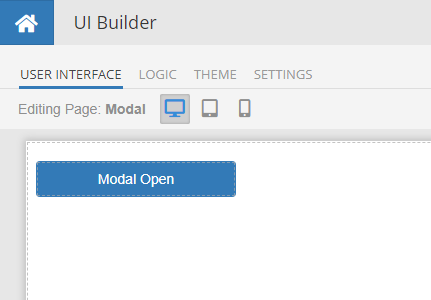
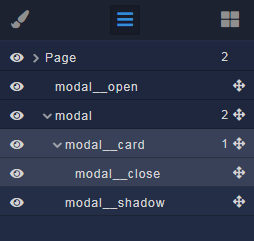
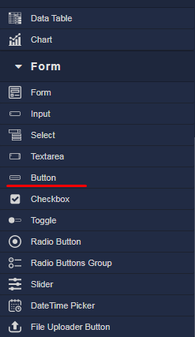
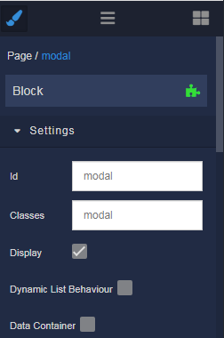
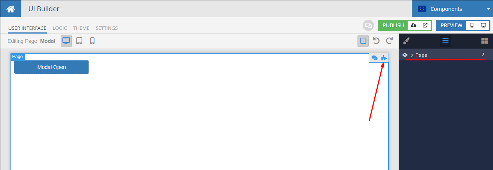
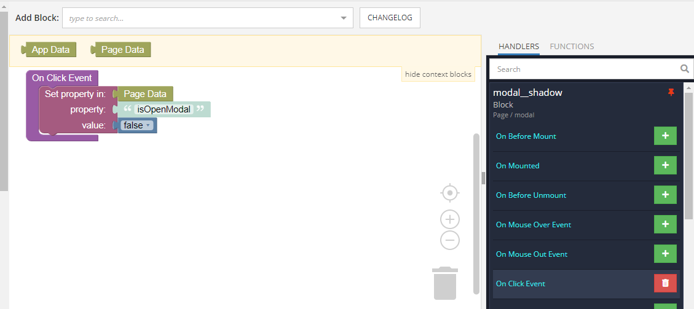

# Modal Window

_This tutorial shows how to build a modal window step by step_

An example of a component can be viewed **[demo](https://eu.backendlessappcontent.com/8AAA8E74-06F7-48FD-9154-1AA3227BFA24/D8E91033-BD89-40C0-9FD9-126973003E38/files/web/app/index.html?page=Modal)**

## Disclaimer

Нейминг классов и элементов в этом компоненте используется для примера. Выможете использовать так как вам нравится.

***

## Structure

Начнем собирать модальное окно с создания структуры компонента на вкладке User interface



Общая структура компонента, для наглядности ID элементов названы так же как и классы.



### Descriptions blocks
- modal__open - кнопка открытия модального окна, любое ваше кастомное решение
- modal - корневой элемент модального окна, обязательный элемент
    - modal__card - коневой блок для вашего контента, внутрь этого элемента поместите то что вам надо, обязательный элемент
        - modal__close - кнопка закрытия модального окна, можно делать как вам надо
    - modal__shadow - затеняющая шторка за модальным окном, ограничивает доступ к другим элементам страницы, обязательный элемент

Все элементы компонента кроме кнопок используют элемент Блок.


Для кнопок я использовал элемент Баттон, но вы можете использовать то что вам надо



Когда создаете элементы **сразу назначайте ID и Classes** в соответствии со структурой



**После того как создадите всю структуру компонента** надо сбросить все настройки для элементов. Для этого надо удалить все выделенные свойства, позже мы укажем нужные через стили. Свойства паддинг и марджин ставим 0 и потом так же сбрасываем. Некоторые свойства сбросить не получится, просто пропустите это)


***

## Styles

Для создания стилей переключаемся на вкладку Theme. Внутри выбираем вкладки Editor и Extensions


Создаем Extensions. Названия можете использовать как вам удобно


**MxModal** less-mixin для удобства множественного использования. Редактируйте если понимаете что делаете!

```less
.mx-modal {
    display: none !important;
    position: fixed !important;
    top: 0 !important;
    bottom: 0 !important;
    left: 0 !important;
    right: 0 !important;
    z-index: 1000 !important;
    flex-direction: column !important;
    justify-content: center !important;
    align-items: center !important;
    width: 100% !important;
    height: 100% !important;
    padding: 0 15px !important;

    &.open {
        display: flex !important;
    }

    @media (min-width: 768px) {
        padding: 0 !important;
    }
}

.mx-modal__curtain {
    position: fixed !important;
    top: 0 !important;
    bottom: 0 !important;
    left: 0 !important;
    right: 0 !important;
    z-index: -1;
    background-color: rgba(0, 0, 0, 0.7);
    width: 100% !important;
    height: 100% !important;
}
.mx-modal__card {
    width: 100% !important;

    @media (min-width: 768px) {
        width: 600px !important;
    }
}
```

**Modal** общая стилизация в соответствии с вашим проектом. Самое важное это импорт миксинов, остальные свойства как вам удобно

```less
.modal__open {
    width: 200px !important;
}
.modal {
    .mx-modal();

    flex-direction: column !important;
    justify-content: center !important;
    align-items: center !important;
}
.modal__card {
    .mx-modal__card();

    flex-direction: column !important;
    justify-content: flex-end !important;
    align-items: flex-end !important;
    background-color: #fff;
    width: 600px !important;
    height: 300px !important;
    border-radius: 5px;
    box-shadow: 0px 3px 1px -2px rgb(0, 0, 0, 0.20), 0px 2px 2px 0px rgb(0, 0, 0, 0.14), 0px 1px 5px 0px rgb(0, 0, 0, 0.12);
}
.modal__close {
    width: 200px !important;
}
.modal__shadow {
    .mx-modal__curtain();
}
```
***

## Logic

Начнем добавление логики с корневого элемента Page, для этого возвращаемся на вкладку User interface, выбираем элемент Page и кликаем на иконку пазл как на скрине.



В открывшейся вкладке Logik для элемента Page вешаем на событие On Page Enter логику как на скрине. Так мы создадим глобальную переменную isOpenModal состояния модального окна для всей страницы. Устанавливаем значение False, что в нашей логике будет определять закрытое модальное окно. 

Если вы хотите использовать несколько разных модальных окон, то добавьте для каждого окна свою уникальную переменную.


Чтобы не переходить между вкладками для выбора следующих элементов воспользуемся навигатором. Для этого открепим элемент Page нажав на иконку кнопки.


Теперь добавляем логику для остальных элементов.

На кнопкt открытия окна используем событие On Click Event. Меняем значение переменной isOpenModal на True


Аналогично добавляем на клик по кнопке закрытия и затеняющей шторке




Осталось добавить логику на элемент с классом modal. Для этого используем событие Class List Logic. Здесь в зависимости от значения переменной isOpenModal добавляется или убирается класс open.


***

I hope that you found this useful and as always happy codeless coding!
